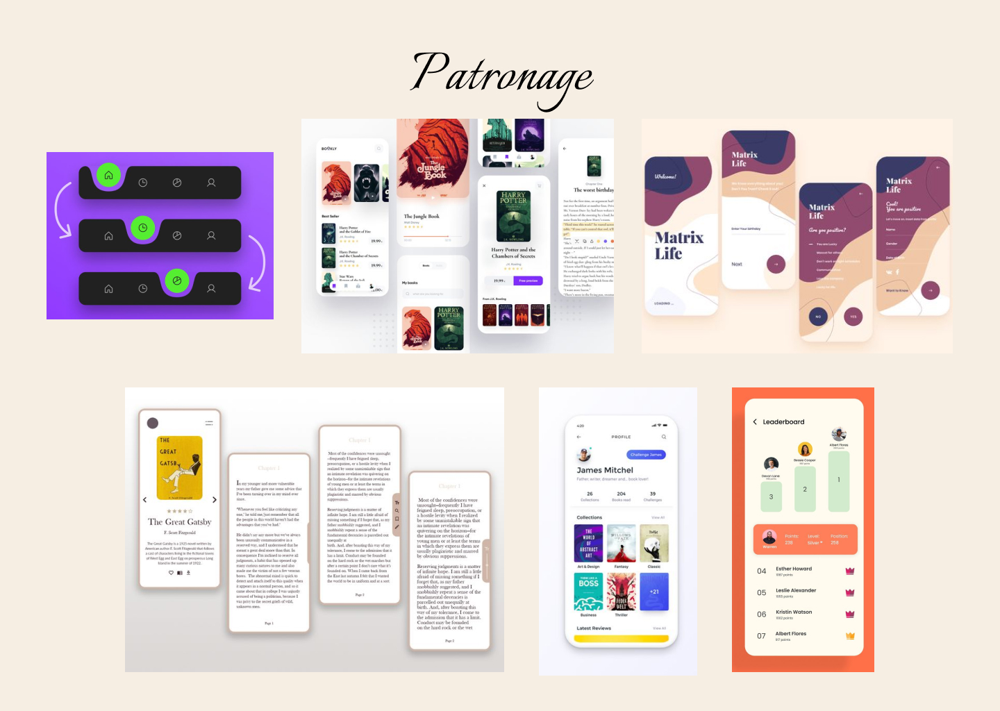
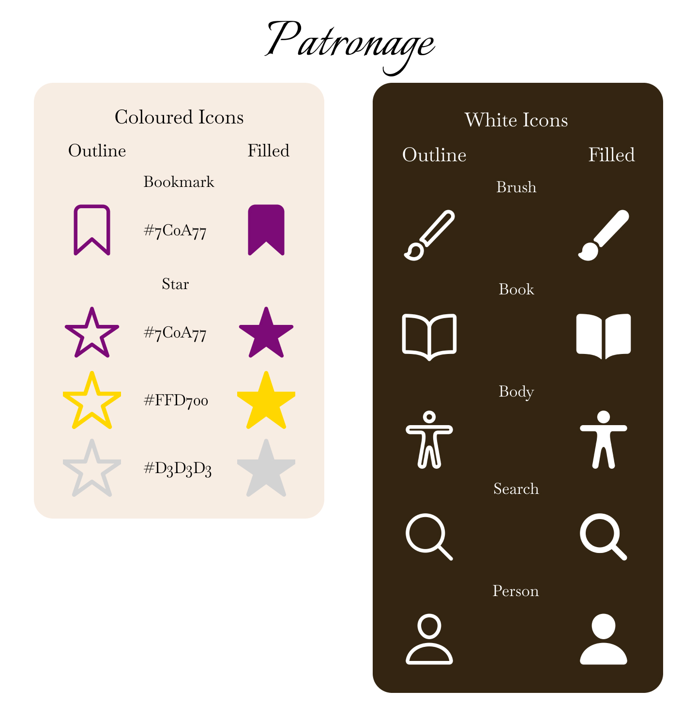

<!-- Project Info -->
<br>


<!-- Logo and link to repository -->
<p align="center">
  <a href="https://github.com/Pantonym/DV300Term2">
    
  </a>
</p>

<!-- Short Description -->
<h3 align="center">Patronage: Writing Competitions Made Easy</h3>
<p align="center"> This is a writing competition manager mobile application utilizing Firebase
    <br>
    <!-- Bug and New Feature Links -->
    <a href="https://github.com/Pantonym/DV300Term2/issues">Report Bug</a>
    <a href="https://github.com/Pantonym/DV300Term2/issues">Request Feature</a>
    <br>
</p>

<!-- Name and Number In Alphabetical Order -->
<div>
    <h5 align="center" style="padding:0;margin:0;">Nico van Wyk</h5>
    <h5 align="center" style="padding:0;margin:0;">Student Number: 221179</h5>
    <br>
</div>
<!-- Subject and Term -->
<h6 align="center">DV300 | Term 2</h6>

<!-- TABLE OF CONTENTS -->
## Table of Contents

- [Table of Contents](#table-of-contents)
- [About the Project](#about-the-project)
  - [Featured Mockup](#featured-mockup)
  - [Project Description](#project-description)
  - [Technologies Used](#technologies-used)
  - [Built With](#built-with)
    - [React Native](#react-native)
    - [Expo](#expo)
    - [Firebase/Firestore](#firebasefirestore)
- [Getting Started](#getting-started)
  - [Prerequisites](#prerequisites)
  - [Installation](#installation)
- [Features and Functionality](#features-and-functionality)
- [Development Process](#development-process)
  - [Architecture](#architecture)
  - [Design Frame](#design-frame)
  - [Solution](#solution)
  - [Theme](#theme)
  - [Development Documents](#development-documents)
    - [Highlights](#highlights)
    - [Challenges](#challenges)
  - [Future Implementation](#future-implementation)
- [Final Outcome](#final-outcome)
  - [Mockups](#mockups)
  - [Video Demonstration](#video-demonstration)
- [License](#license)
- [Authors](#authors)
- [Contact](#contact)
- [Acknowledgements](#acknowledgements)
- [References](#references)

<!-- About the Project -->
## About the Project

<!-- Mockup -->
### Featured Mockup


<!--PROJECT DESCRIPTION-->
### Project Description
Patronage is a competition management mobile application where users can write stories of different genres and upload them to a leaderboard. They can then read and vote on their favourite stories using a scale of 1-10 to show how much they enjoyed each story.
### Technologies Used
* React Native
* Expo
* Firebase/Firestore

### Built With
<!-- React Native -->
#### React Native
* A JavaScript library used to build the frontend of the application.
* Uses components to render the front end.
* Used for cross-platform development.
<p>React Native was used to build the front end.</p>


<!-- Expo -->
#### Expo
* Open source framework.
* Allows apps to be created for multiple platforms, even including web.
* Used as a cross-platform framework, as well as for testing through ExpoGo.
<p>Expo was used to test the website, as well as allow it to be cross-platform</p>


<!-- Firebase/Firestore -->
#### Firebase/Firestore
* Cloud Computing Service used to create the backend of the application.
* JavaScript was used to contact it.
* Is a NoSQL database.
* Firebase was used for text-based data and Firestore was used for images.
<p>Firebase/Firestore was used to implement backend functionality to implement CRUD functionality to the application.</p>


<!-- GETTING STARTED -->
## Getting Started
These instructions will get you a copy of the project up and running on your local machine for development and testing purposes.

### Prerequisites
For development and testing, the latest version of Node.js is required, which is available here: [Node.js](https://nodejs.org/en).

### Installation
Here are a couple of ways to clone this repo:

1.  GitHub Desktop </br>
    Enter `https://github.com/Pantonym/DV300Term2.git` into the URL field and press the `Clone` button.
</br>
2.  Clone Repository </br>
    Run the following in the command-line to clone the project:

    ```sh
    git clone https://github.com/Pantonym/DV300Term2.git
    ```
The following installations are required if you do not clone the repository:
* Click on Terminal and open a new terminal
* Install Dependencies:

  * npm install
</br>

* Start Application:
  * npm start

</br>

* List of Dependencies:
1. npm install expo-status-bar@~1.12.1 
2. npm install react-native@0.74.1
3. npm install expo@latest
4. npm install @react-navigation/native-stack
5. npm install @react-navigation/native
6. npm install react-native-screens react-native-safe-area-context
7. npm install firebase
8. npm install expo-font
9. npm install react-native-reanimated
10. npm install @react-native-picker/picker
11. npm install @react-native-async-storage/async-storage
12. npm install expo-image-picker
13. npm install react-native-uuid

<!-- Main Features and Functionality -->
## Features and Functionality
1. App Icon and Splash Screen
* The required png's were placed inside of the `assets` folder, and as the names were consistent with the standardised names, no code updates were needed.

2. Authentication Screens
* Users are able to log in and out using Firebase Authentication:
``` 
const userCredential = await signInWithEmailAndPassword(auth, email, password);
await signOut(auth)
```
</br>

* They are also able to create new accounts:
```
createUserWithEmailAndPassword(auth, email, password)
```
</br>

* Persistence was implemented using AsyncStorage:
```
const authInstance = initializeAuth(app, {
    persistence: getReactNativePersistence(AsyncStorage)
});
```
</br>

* Extra Functionality - Administrator User:
  * There is only one administrator account, so the following check was used to see ig the user is an admin:
```
const [isAdmin, setIsAdmin] = useState();
useEffect(() => {
 const fetchUserData = async () => {
   const email = await AsyncStorage.getItem('UserEmail');
   setIsAdmin(email === "greatquill.patronage@gmail.com")
 };
 fetchUserData();
}, []);
```
</br>

3. Competitions
   1. <b>Upload an entry</b>
* Showcase all competitions the user can enter (genres within the story ype of Short Stories) - This was completed thorough a .map function that displayed all genres of the Short Stories collection. It is important to note that the database has already been future-proofed for added story types (poems, novels, etc), but to enhance the user experience for the current build, the user can only access short stories (writing and reading):
```
const renderGenres = () => {
  return genres.map((genre, index) => (
    <TouchableOpacity
      key={index}
      style={styles.genreCard}
      // Navigate to the genre screen for this specific genre
      onPress={() => navigation.navigate('GenreScreen', genre.value)}
      >
        <Text style={styles.genreText}>{genre.label}</Text>
    </TouchableOpacity>
  ));
};
```
  * The same logic is used to display all leaderboards for the same genres.
</br>

* The user can enter competitions by following this user journey:


  * The user can publish a story to enter it into a competition, which uploads the story to the Leaderboards collection in the database. To uphold integrity between competitions, if the user unpublishes a story to publish it again all ratings and comments are removed - this stops winning stories from being entered with their winning votes again.
</br>

* Generate a leaderboard item:
```
// Find the index of the story the user clicked on
 for (let k = 0; k < works.length; k++) {
    if (works[k].title == storyTitle) {
    // Set that work's completed value to true
      works[k].completed = true
    // build the leaderboard item
      leaderboardItem = {
      "id": works[k].id,
      "authorID": userID,
      "genre": works[k].genre,
      "description": works[k].description,
      "title": works[k].title,
      "chapters": [{
        "chapterTitle": works[k].title,
        "chapterContent": works[k].chapters[0].chapterContent,
        "comments": [],
        "ratings": []
      }]
    }
    chosenGenre = works[k].genre;
    chosenGenre = chosenGenre.toLowerCase();
  }
}
```
</br>

* Save the data to the Leaderboards collection:
```
// Push the new leaderboard item to the genreData array
genreData.push(leaderboardItem);
  // Update the genreData in Firestore
  await updateDoc(storiesRef, {
    [chosenGenre]: genreData
  });
console.log("Genre data updated successfully");
```

  * The competitions do not need to be monitored to see if they are open or closed as they will always be open.
</br>
    ii. <b>Vote on an entry</b>

* The page will first test to see if the user is allowed to vote: It will compare the author's ID with the user's, and  if they are the same, the user cannot vote. It will also test to see if the user is an Admin, in which case they cannot vote either.
* The page will then test to see if the user has already voted on this story (by looping through the votes array and flagging if it sees the logged in user's ID).
* Finally, if the user is eligible for voting, they can choose an amount out of 10 (represented by stars) and submit their rating:
```
// Handle rating function
  const handleRating = async () => {
    // Convert the string to an integer
    const ratingValue = parseInt(rating, 10);
      // Validation
      // --If the rating is less than 1, more than 10 or not a number at all
      if (ratingValue < 1 || ratingValue > 10 || isNaN(ratingValue)) {
        Alert.alert('Invalid Rating', 'Please enter a rating between 1 and 10.');
        // Exit the function if there is an error so it does not try to upload invalid information.
        return;
      }
      try {
        // Show loader
        setLoadingVisible(true);
        // Submit the data to add the rating
        const result = await rateStory(story.authorID, ratingValue, story.title, story.genre);
      if (result) {
        Alert.alert('Success', 'Your rating has been submitted.');
        // rerender the stars
        setReRender(reRender === false);
      } else {
        Alert.alert('Error', 'You have already voted on this story.');
      }
    } catch (error) {
      console.error('Error rating the story:', error.message);
      Alert.alert('Error', 'Failed to rate the story. Please try again later.');
    } finally {
      // Hide loader
      setLoadingVisible(false);
  }
};
```
</br>
    iii. <b>View Competition & Results</b>

* The user can view the competition by viewing the leaderboards page, which displays the top 5 highest ranking stories. It will only display the leaderboard if there are 5 stories with at least 5 votes each. This prevents users with 1 vote from winning due to having a higher percentage than others with more votes.
* To view the results, the user can view other profiles to see their awards. Only the top 3 stories will give users awards:
```
<FlatList
  data={stories}
  keyExtractor={(item) => item.id}
  renderItem={({ item, index }) => (
    <View key={index} style={styles.storyCard}>
      ...
      <View style={styles.ratingHolder}>
        <Text style={styles.averageRating}>{calculateAverageRating(item.chapters[0].ratings).toFixed(1)}%</Text>
      </View>
```
</br>

* The rating is also visualised using a percentage graph, which uses the rating as a percentage to declare the width of the graph.
```
<View
  style={{
    height: 20,
    backgroundColor: '#CAA775',
    width: '${calculateAverageRating(item.chapters[0].ratings)}%',
    alignSelf: 'start',
    borderTopRightRadius: 10,
    borderBottomRightRadius: 10
  }}
/>
```

* The administrator can end a competition from the leaderboard screen
```
{isAdmin ? (
  <TouchableOpacity style={styles.button} onPress={() => handleEndCompetition(genre)}>
    <Text style={styles.buttonText}> End Competition</Text>
  </TouchableOpacity>
) : null}
```

  * Service function:
```
export const endCompetition = async (genre) => {
  try {
    ...
    genreStories.sort((a, b) => b.averageRating - a.averageRating);
    const top3Stories = genreStories.slice(0, 3);
    const year = new Date().getFullYear();
    ...
      // Add story to previousLeaders collection under genre/year
      const previousLeaderRef = doc(db, 'previousLeaders/${normalizedGenre}/${year.toString()}/${story.id}');
      await setDoc(previousLeaderRef, {
        ...story,
        place,
        year
      });
      // Add award to the user
      await addAward(story.authorID, genre, place, year.toString());
      }
    // Set the genre stories to an empty array
    allStories[normalizedGenre] = [];
    // Update the leaderboards collection
    await updateDoc(storyRef, allStories);
    ...
```
</br>

* Winners are awarded with awards, a card applied to their profile that displays either gold, silver or bronze. It also displays the genre they won an award for, as well as the year they won it.
```
export const addAward = async (userID, selectedGenre, selectedPlace, selectedYear) => {
  ...
  var data = docSnap.data();
    data.awards.push({
      "genre": selectedGenre,
      "place": selectedPlace,
      "year": selectedYear
    })
  await updateDoc(docRef, data);
  } else {
    console.log("No such document!");
  }
}
```
<br>

4. Project Planning Functionality - Comments
* The comment is simply pushed into the array of comments on the story, saving the commenter's id and the content of the comment.
```
...
if (docSnap.exists()) {
  const allStories = docSnap.data();
  for (const genre in allStories) {
    const stories = allStories[genre];
    for (let story of stories) {
      if (story.id === storyID) {
      // Add the comment to the specified chapter (future proofing for other story types with more than one chapter)
      story.chapters[chapterIndex].comments.push(comment);
      // Update the Firestore document
      await updateDoc(storiesRef, { [genre]: allStories[genre] });
      return true;
    }
  }
}
```
</br>

5. Advanced functionality:
   1. <b>Administrator account</b>
* This was chosen as it eased the ending of competitions, moving away from an automated system to an administrator-controlled one. I have already shown how the user is tested ti see if they are an admin, but in addition to that the administrator has a different navbar to reflect different functionalities (search for users, etc).
</br>

   2. <b>Favourite Stories</b>
* A user can add a story to their favourites list for the duration of a leaderboard/competition. It adds the story ID to an array on the user's account, and then the Profile Page will loop through it to fetch each story by its ID, sending it to the Favourite Stories Page to display. 
* In addition, if a competition ends and a story is no longer accessible, the page automatically removes the undefined item from the user's favourites list.
```
if (data.favouriteStories) {
  const validStories = [];
  const invalidStoryIDs = [];
  for (const storyID of data.favouriteStories) {
  const storyData = await getShortStoryByID(storyID);
  if (storyData) {
    validStories.push({ ...storyData, id: storyID });
  } else {
    console.log('Story not found:', storyID);
    invalidStoryIDs.push(storyID);
    // Immediately remove the invalid story from the user's favourite stories
    const userRef = doc(db, 'users', userID);
    await updateDoc(userRef, {
      favouriteStories: data.favouriteStories.filter(id => id !== storyID)
    });
    // Update the data object to reflect the change
    data.favouriteStories = data.favouriteStories.filter(id => id !== storyID);
  }
}
if (invalidStoryIDs.length > 0) {
    console.log('Removed invalid stories:', invalidStoryIDs.join(', '));
}
setFaves(validStories);
```
  * The undefined item is immediately removed without importing a function to ensure it is properly removed. This causes one of the inly exceptions to storing database-accessing functions in a service file.
</br>

   3. <b>Follow Authors</b>
* The followed authors array is populated like the favourite stories array - an id is added to the array, and on the profile page it is called, a useState is populated and sent to the Followed Authors Screen for display
</br>

   4. <b>Search Stories/Users</b>
* Users can search through stories, and admins can search through stories and users. Both searches function similarly, so only one will be shown:
```
// Handle search functionality
  const handleSearch = (text) => {
    setSearchQuery(text);
    const filtered = shortStories.filter(item =>
      item.title.toLowerCase().includes(text.toLowerCase())
    );
  setFilteredData(filtered);
};
```
</br>

   5. <b>Upload profile icon/change it and other profile data</b>
* Authentication data is updated with Firestore functions:
```
updatePassword(user, newPassword).then(() => ...
```
</br>

* For the profile icon, an image is uploaded and the uri is saved to the database while the image is saved to FireStore
```
export const changeUserProfileIcon = async (uri, userID) => {
    const docRef = doc(db, "users", userID);
    const docSnap = await getDoc(docRef);
    if (docSnap.exists()) {
        const userData = docSnap.data();
        var userImg = userData.userImg;
        // Add the new story to the works array
        userImg = uri;
        // Update the user's document in Firestore with the new works array
        await setDoc(docRef, { ...userData, userImg });
        console.log("Profile Changed Successfully");`
    } else {
        console.log("No such document!");
    }
}
```
  * FireStore upload:
```
export const handleImageUpload = async (uri, fileName) => {
    const blob = await new Promise((resolve, reject) => {
        const xhr = new XMLHttpRequest();
        xhr.onload = function () {
            resolve(xhr.response);
        }
        xhr.onerror = function (e) {
            console.log(e);
            reject(new TypeError("Network request failed"));
        }
        xhr.responseType = "blob";
        xhr.open('GET', uri, true);
        xhr.send(null);
    })
    const imageRef = ref(storage, fileName);
    const uploadResult = await uploadBytes(imageRef, blob);
    await changeUserProfileIcon(await getDownloadURL(imageRef), fileName)
    blob.close();
}
```

<!-- Development PROCESS -->
## Development Process
### Architecture
The application consists of multiple React Native pages and components. It communicates with a NoSQL database to receive and send information. `Firebase.js` was created to contact the database, and service files handled functionality.
### Design Frame
How might we create a mobile application that hosts and controls a competition, allowing users to vote for and create entries that are sent to competition leaderboards.
### Solution
Patronage, a mobile application that allows users to write and vote for short stories they enter into genre-based competitions.
### Theme
Patronage was designed to evoke the feelings of the old system of patronage - where a wealthy benefactor pays an artist to create art. It alsos eeks to gamify the contest by having the competition 'organiser' be a mysterious being that is seen in the logo of the app.

### Development Documents
<!-- Moodboard -->
* Moodboard


<!-- Iconography -->
* Iconography


<!-- Colour Palette -->
* Colour Palette


<!-- Data Planning - ERD -->
* Data Planning
  * ERD


  * Object Mapping


  * User Journeys
  1. Full


  2. Excerpt 1


  3. Excerpt 2


<!-- Screen Mockups -->
* Screen Mockups
[Google Drive Folder](https://drive.google.com/file/d/12HMVlVa1em7oYBCpXcDwkNQm8eub9n2Y/view?usp=sharing)

<!-- Highlights -->
#### Highlights
* React Native was very delightful to work with, and its similarity to React Web made learning Native much easier.
* Firebase was also interesting and engaging, providing an intuitive database from which to read and write data.
* Creating an enclosed app was also surprisingly fun, allowing me to mix my User Experience Design knowledge with Interactive Development.
* ExpoGo made testing the application very easy and intuitive - much more than the emulator.

<!-- Challenges -->
<!-- Explain the challenges faced with the project and why you think you faced it or how you think you'll solve it (if not solved), or how you solved it -->
#### Challenges
* Persistence was difficult to implement, needing multiple firebase.js changes until finally AsyncStorage managed to work.
* Working with the database as it expanded without having subcollections was a challenge, and the database would have to be refactored in the future.
* Expo crashing unexpectedly was a challenge, caused by unexpected version changes, and was fixed after updating the app.
* The database being reset from poor write statements was an irritation, fixed through testing smaller writes before larger ones.

<!-- Future Implementation -->
### Future Implementation
* Refactor the database to use subcollections.
* Allow other story types to be added, such as poems or long stories.
* Allow multiple chapters to be added to stories, even short stories.
* Add another collection that stores published stories without relying on the leaderboards collection, allowing all past stories to be saved (not just the winning three stories).

<!-- Final Outcome -->
## Final Outcome
<!-- MOCKUPS -->
### Mockups


<br>

<!-- Video Demonstration -->
### Video Demonstration
**Video Demonstration:** <a href="https://drive.google.com/file/d/1bWlUuYpcTAeqSx_UzottlSyqlab93XWJ/view?usp=sharing">Google Drive Link</a>

<!-- LICENSE -->
## License
Distributed under the MIT License. See `LICENSE` for more information.

<!-- AUTHORS -->
## Authors
* **Nico van Wyk** - [Github](https://github.com/Pantonym)

<!-- Contact -->
## Contact
**Nico van Wyk** - [221179@virtualwindow.co.za](mailto:221179@virtualwindow.co.za)

<!-- ACKNOWLEDGEMENTS -->
<!-- all resources that you used and Acknowledgements here -->
## Acknowledgements
* [Lecturer](https://github.com/ArmandPretorius), for supplying contact sessions and coding knowledge.
* [Figma](https://www.figma.com/), for interface design.
* [Firebase](https://firebase.google.com/docs/firestore/), for providing documentation on data management.
* [ChatGPT](https://chatgpt.com), for help with debugging.

## References
* [Link](https://worldvectorlogo.com/logo/react-native-1) (React Native Logo)
* [Link](https://worldvectorlogo.com/logo/expo-go-app) (Expo Go Logo)
* [Link](https://firebase.google.com/brand-guidelines) (Firebase)